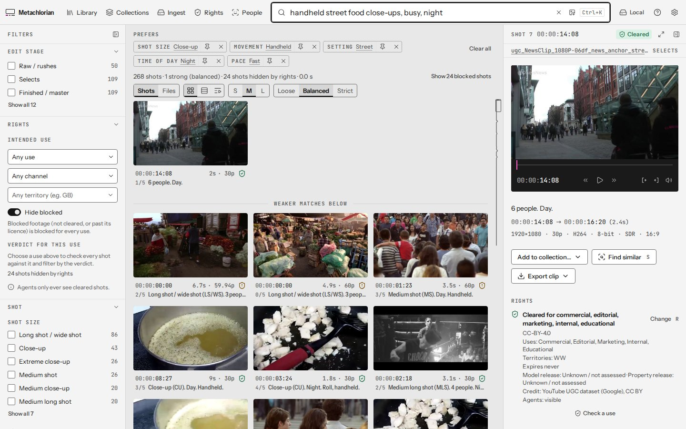
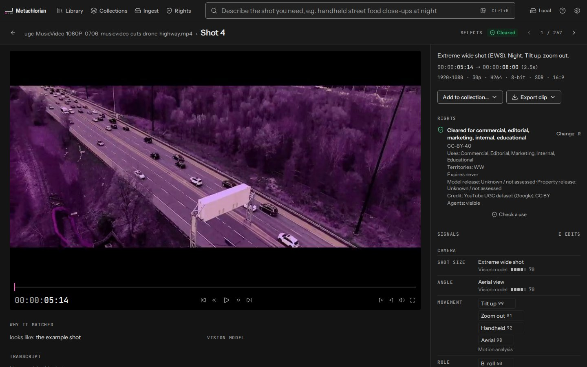
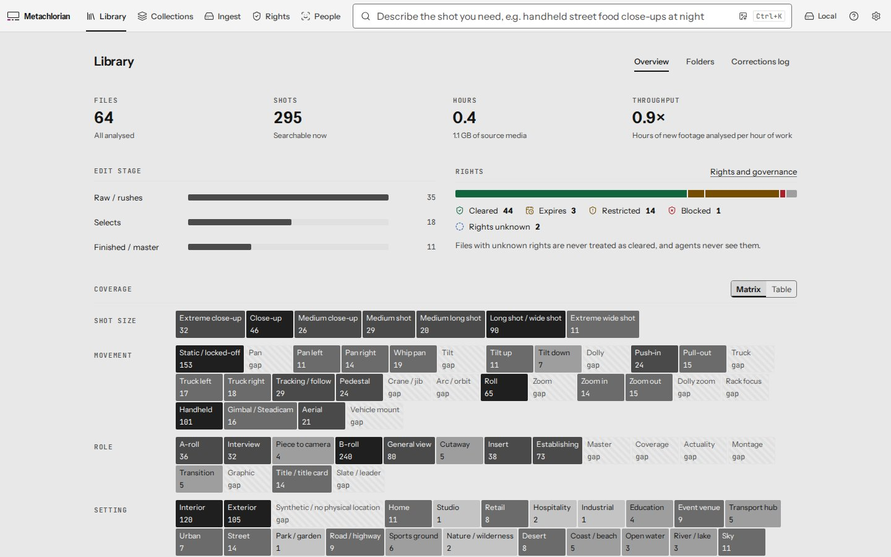
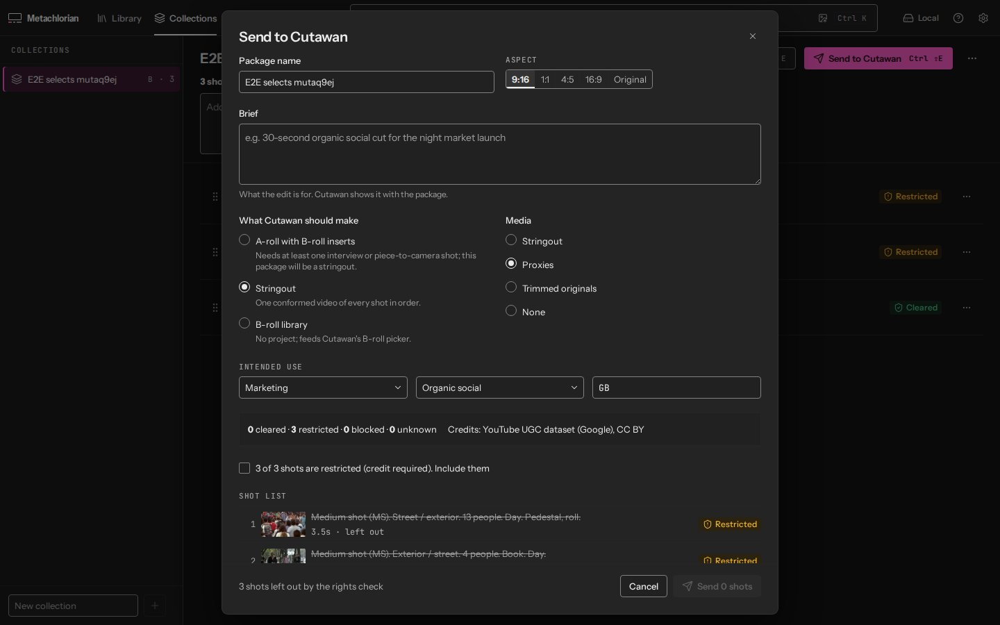

# Metachlorian

**A self-hostable video library that understands every shot.** Point it at a folder or bucket of footage and it works out
what every shot shows, how it was filmed, how it is paced, what role it plays, how usable it is and whether you can legally use
it. Then people and AI agents can find exactly the footage they need in seconds.

> "Slow, wide drone shots of a coastline at golden hour, no people, at least 8 seconds, 4K."
> "Which of these files are raw single takes and which are finished edits?"
> "Three B-roll cutaways that would work under this interview line about family holidays."
> "What do we have from Lisbon that we're actually cleared to use on paid social?"

Metachlorian is the *knowing* half of a pair: [Cutawan](https://github.com/JeremySNR/cutawan) edits video. Metachlorian
indexes, describes and retrieves it, then hands selected shots to Cutawan or any editing software (OpenTimelineIO, FCPXML,
CMX 3600 EDL).

## What it does

- **Shot-level index.** Every file is split into shots (hard cuts, dissolves, fades) and long takes into segments.
  Each shot gets a structured record, and every signal has a value, a source, a confidence and a model version.
- **Measured, not guessed.** Shot boundaries, durations, cuts per minute, technical metadata, camera motion (optical flow),
  loudness (EBU R128) and image quality are computed deterministically. Models are used for meaning: SigLIP embeddings and
  zero-shot labels, speech with word timings (Parakeet), speaker turns, audio events, OCR, people and objects,
  and optional captions from a vision-language model.
- **Hybrid search.** Natural language is parsed into filters and vocabulary preferences; results blend semantic similarity,
  keywords in transcripts and on-screen text, and label matches, and every result says *why* it matched. Query by example
  with a shot, a still or a clip.
- **Rights-aware.** Record source, licence, permitted uses, channels, territories, expiry and releases per file (overridable per
  shot). State an intended use and you only get shots cleared for it.
- **Import from the web.** Paste YouTube, Vimeo or other video links (or a whole playlist) and they are downloaded into
  a folder of your choice and analysed like everything else, remembering where they came from. Rights start as unknown
  until someone checks them. Uses yt-dlp, the same importer as Cutawan.
- **Community search.** Find matching moments in analysed YouTube videos through the [community index](https://metachlorian-community.vercel.app).
  New YouTube downloads contribute machine metadata by default. Settings → Community sharing turns this off.
  Local and personal files, local duplicates, human notes and face identities are excluded. Turn sharing off before importing private or unlisted YouTube videos. Full local records stay local.
- **People you can name.** Faces are recognised across shots and files (locally; embeddings never leave the library).
  Name someone once and "Maria laughing in the kitchen" finds them. Merge, split or forget people at any time.
- **Corrections stick.** Fix a tag and it is stored separately from machine output and wins over it, even after re-processing.
- **Agents are first-class.** An MCP server and a REST API expose everything the app can do. Agents are read-only by default,
  need explicit scopes to write or export, and every agent action is audited.
- **Runs on your hardware, or faster with a provider.** Default models run locally on CPU; a consumer GPU makes it faster.
  For richer captions and much higher throughput, plug in an OpenAI API key, OpenRouter, or your ChatGPT subscription via
  the Codex CLI. Hosted model analysis requires an admin to enable a provider. Separately, new YouTube imports contribute machine metadata to the community index by default; opt out in Settings → Community sharing. Local and personal files are excluded. For private or unlisted YouTube imports, turn sharing off first if you want their metadata to stay private.

## Screenshots

| | |
|---|---|
|  |  |
| Search: the query becomes editable chips; every result explains why it matched | Shot detail: each signal shows its source and confidence; corrections are marked human |
|  |  |
| Library overview: edit stage, rights, coverage gaps | Collections go to Cutawan or out as OTIO / FCPXML / EDL |

All journeys, at desktop, laptop and tablet sizes in light and dark: [review/m4](review/m4/index.md).

## Quick start

**Server or NAS (Docker):**

```bash
git clone https://github.com/JeremySNR/Metachlorian && cd Metachlorian
METACHLORIAN_ADMIN_PASSWORD='choose-a-long-password' FOOTAGE_DIR=/path/to/footage \
  docker compose -f deploy/docker-compose.yml up -d
# open http://<host>:8765 and sign in as admin
```

**One command (Linux/macOS, Docker or native):**

```bash
curl -fsSL https://raw.githubusercontent.com/JeremySNR/Metachlorian/main/scripts/install.sh | bash
```

**From source (solo mode on your machine):**

```bash
cd core && uv venv -p 3.11 && uv pip install -e ".[analysis]"
.venv/bin/metachlorian models fetch            # local models, ~1.9 GB
.venv/bin/metachlorian serve --add ~/Footage   # http://127.0.0.1:8765
cd ../app && npm ci && npm run build           # the web app the core serves
```

**Desktop app:** `cd desktop && npm ci && npm start` runs the web app in Electron. In solo mode it starts a local core; in team
mode it connects to a shared one. It adds native drag-out of real clip files and one-click hand-off to Cutawan. Installers are
built with `npm run package` (unsigned until signing certificates are provided, see [OPEN_QUESTIONS.md](OPEN_QUESTIONS.md)).

**Agents (MCP):** create a token in Settings → Agents (or `metachlorian token my-agent`), then point your MCP client at
`http://<host>:8765/mcp/` with `Authorization: Bearer <token>`, or run `metachlorian mcp` over stdio (read-only by default).
See [docs/agents.md](docs/agents.md).

## Community sharing

YouTube imports have a separate, default-on sharing setting from hosted model analysis. After analysis finishes,
the app sends only the machine metadata allowlist and download title/channel/licence/duration to the community service.
Videos, frames, audio files and complete library records are never contributed.

**Warning: video visibility is not checked.** Private, unlisted or sensitive YouTube imports can publish their titles,
descriptions, transcripts and on-screen text. Turn off **Settings → Community sharing** before importing them if you
want that metadata to stay private. Published metadata can remain searchable after the original video becomes private
or is deleted. Opting out stops pending contributions; it does not remove already published metadata.

The default service is `https://metachlorian-community.vercel.app`; its [source and deployment guide](https://github.com/JeremySNR/Metachlorian-community)
live in a separate repository and database. No YouTube API key or Google Cloud setup is required.
Community search sends your query to that service and opens results at matching YouTube timestamps.
Analysis and contributor-reported licences may be wrong and do not establish reuse rights.
The community operator can remove a video from the index.

Turn sharing off in **Settings → Community sharing**, or set `METACHLORIAN_COMMUNITY_ENABLED=false` before starting the app.
`METACHLORIAN_COMMUNITY_URL` selects a self-hosted service (HTTPS required except on loopback).
Videos imported while sharing is off are never backfilled; turning it off also suppresses pending updates.
Only newly downloaded YouTube bytes are enrolled, so existing libraries, local/personal files, other websites and local
duplicates are never uploaded automatically. Replaced or deleted downloads are excluded.
Network failures leave contributions pending for retry; local analysis continues normally.
`metachlorian community-sync` retries a bounded batch without running the web server.

## Hardware tiers

| Tier | What runs | Speed (this build's reference box: 4 vCPU, no GPU) |
|---|---|---|
| CPU only | Everything except VLM captions: shots, motion, quality, audio, speech, OCR, people, embeddings, zero-shot labels, rules-based fusion | **1.7 hours of footage per hour** with 3 workers; search median 325 ms at 1.6 M shots ([eval](eval/README.md)) |
| Single consumer GPU (8–12 GB) | Adds a local VLM (Qwen3.5 4B/9B via llama.cpp or Ollama) for dense captions and LLM fusion; ONNX models use CUDA | GPU numbers to be measured by maintainers (no GPU in the build environment) |
| Multi-GPU / server | Several workers (`workers = N`), a larger VLM, team mode with many users | scales with workers |

## How it fits together

```
 folders / S3 ──▶ ingest (hash, dedupe, ffprobe) ──▶ job queue (SQLite, resumable, versioned analysers)
                                                         │
     technical → proxy → shots → keyframes → embed → zero-shot tags
                                     ├─▶ motion, quality, people, OCR
                                     └─▶ audio → speech ──▶ caption (VLM, optional) ──▶ fusion ──▶ rollup
                                                         │
                         SQLite (records, FTS5) + usearch HNSW (vectors) ──▶ hybrid search
                                                         │
                       REST API · MCP server · web app · Electron shell · Cutawan / OTIO / FCPXML / EDL
```

Read more: [architecture](docs/architecture.md) · [decision records](docs/decisions) · [design system](docs/design/system.md) ·
[evaluation](eval/README.md) · [licences](docs/licences.md) · [Cutawan hand-off](docs/integration/cutawan-contract.md) ·
[plan](PLAN.md) · [roadmap](docs/roadmap.md) · [open questions](OPEN_QUESTIONS.md).

## Licence

Apache-2.0. Model weights have their own licences (all permit commercial use); see [docs/licences.md](docs/licences.md) and
[NOTICE](NOTICE).
